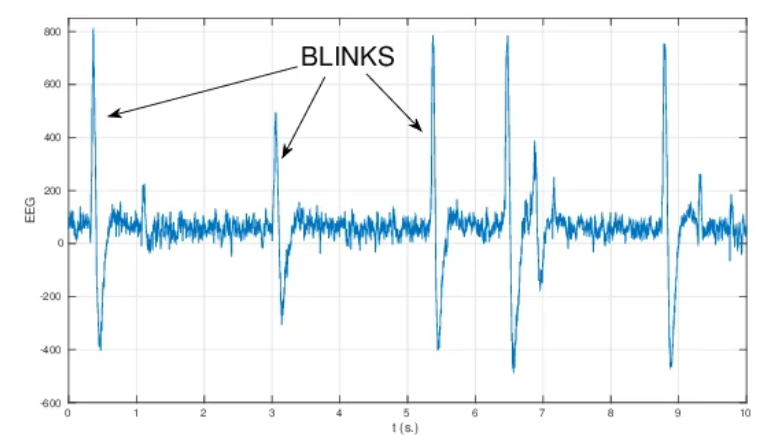
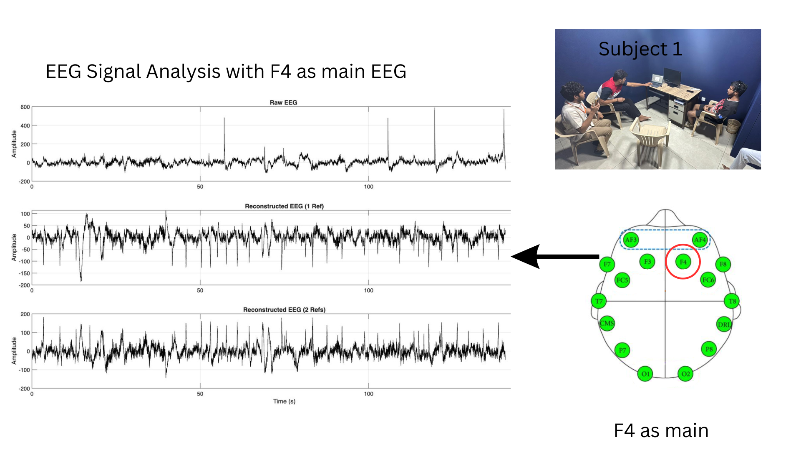
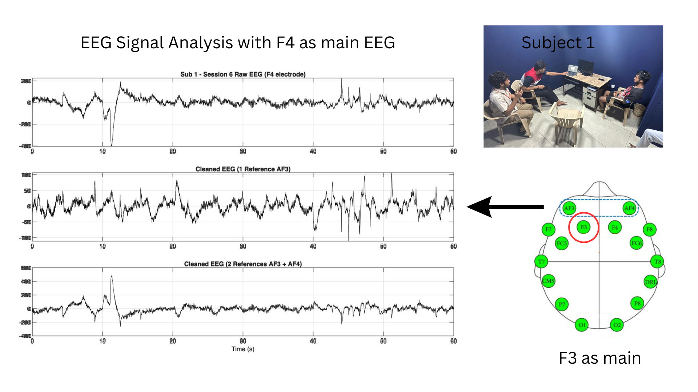
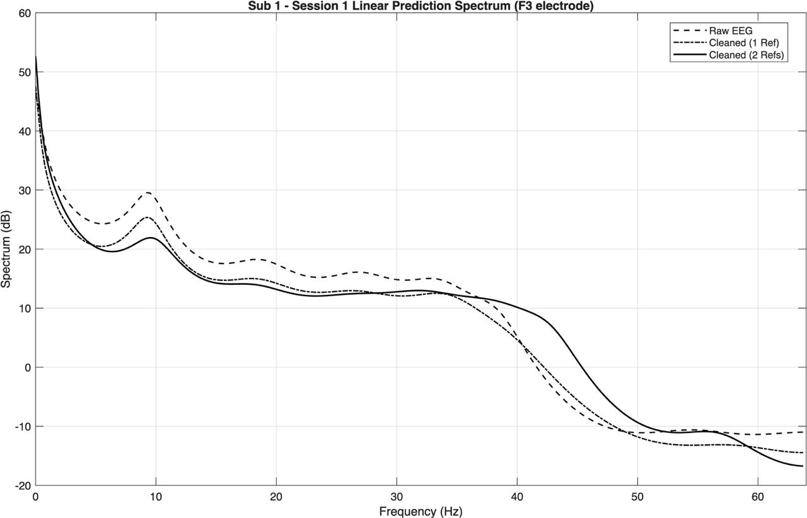
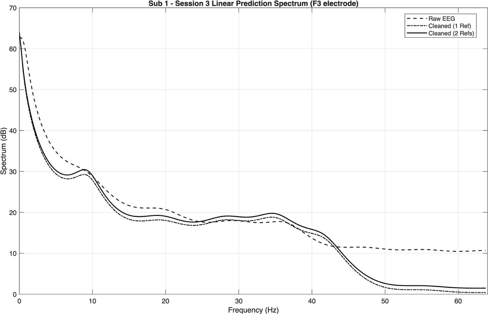
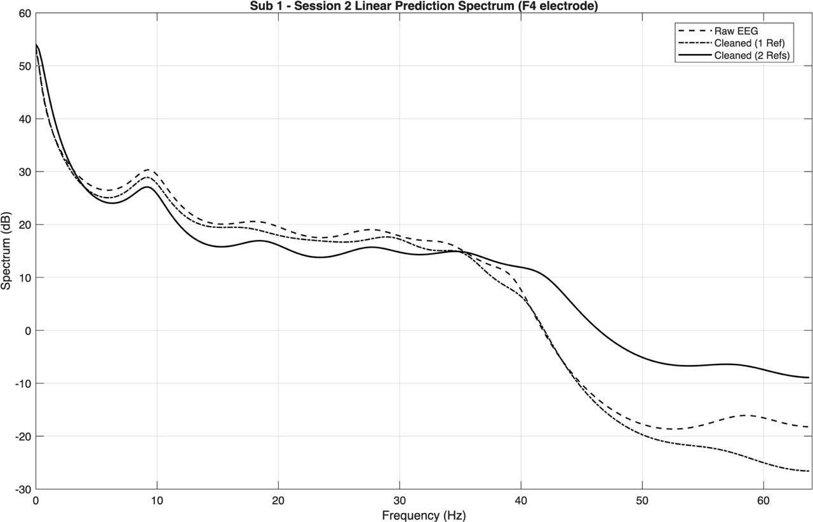
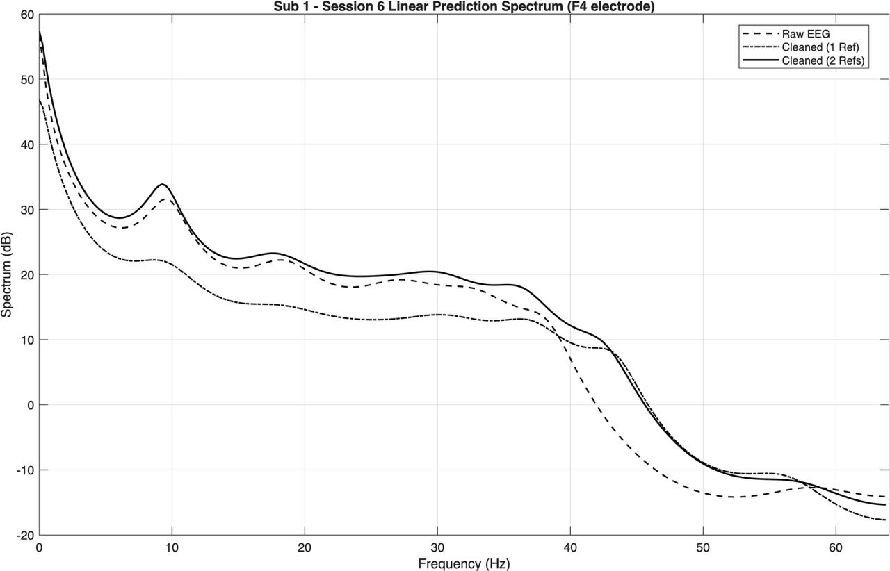

# D9_MFC4_SVD-BASED-NOISE-REDUCTION-IN-EEG-SIGNALS-

SVD-based artifact attenuation workflow for EEG signals contaminated by EOG components.

## Team

- Manohar P - CB.SC.U4AIE24339
- P. Sai Mrudula - CB.SC.U4AIE24340
- B. Sainath Reddy - CB.SC.U4AIE24309
- K. Pushpak Siva Sai - CB.SC.U4AIE24328

## Reference Paper

- Title: SVD based technique for noise reduction in electroencephalographic signals
- Authors: P.K. Sadasivan, D. Narayana Dutt
- DOI: https://doi.org/10.1016/S0165-1684(96)00129-6

## Project Report

Primary report used for this repository:

- [report.pdf](report.pdf)

The report includes the full derivation, dataset setup, methodology, and detailed discussion across abstract, introduction, SVD separation method, and results sections.

Report sections used for this README update:

- Section 5.2: Time-domain signal analysis
- Section 5.3: LP spectral analysis
- Section 5.4: Quantitative energy analysis
- Section 5.5: Additional session-wise visualizations

## Method Summary

1. Construct multi-channel matrices using contaminated EEG plus EOG reference channels.
2. Apply SVD decomposition:
   $M = U\Sigma V^T$
3. Identify artifact-dominant components using singular value structure.
4. Reconstruct artifact-reduced EEG using the selected subspace projection.
5. Validate in time domain and LP spectral domain.

## Experimental Setup (From Report)

- Device: Emotiv Epoc X headset
- EEG channels analyzed: F3 and F4
- EOG reference channels: AF3 (single-ref) and AF3 + AF4 (two-ref)
- Environment: MATLAB workflow for decomposition, reconstruction, and visualization
- Evaluation strategy:
   - Time-domain raw vs reconstructed waveform inspection
   - LP spectral comparison before/after filtering
   - Quantitative energy-loss computation from singular values

## Results Folder

All visual outputs were added under:

- [results](results)

This folder contains experiment visualizations, including:

- time-domain signal figures
- LP spectral comparisons
- session-wise plots and supporting visuals

## Quantitative Results (From Report Table 2)

Energy loss percentages for F3 channel across 6 sessions:

| Session | Energy Loss (1 Ref: AF3) | Energy Loss (2 Refs: AF3 + AF4) |
| --- | --- | --- |
| Session 1 | 69.07% | 69.14% |
| Session 2 | 76.73% | 88.52% |
| Session 3 | 61.86% | 62.73% |
| Session 4 | 76.15% | 82.14% |
| Session 5 | 61.84% | 38.47% |
| Session 6 | 73.18% | 86.49% |

Interpretation from report:

- Two-reference configuration (AF3 + AF4) generally gives stronger artifact removal.
- Single-reference configuration remains effective and stable across all sessions.
- Session variability exists, but SVD consistently attenuates dominant ocular components.

## Visual Results (Carefully Grouped)

### Data Collection / Setup

### Time-Domain Reconstructions

These visuals correspond to raw vs reconstructed EEG comparisons discussed in report Section 5.2.

Reading guide:

- Raw traces show large-amplitude ocular contamination.
- Reconstructed traces suppress blink/eye-movement spikes.
- Two-reference reconstruction typically yields cleaner baselines.

### Session-Wise EEG Visualizations

Representative session-level plots for F3/F4 trends (report Section 5.5):

### LP Spectral Comparisons

LP spectra support preservation of neural rhythms while reducing low-frequency ocular artifacts (report Section 5.3).

Reading guide:

- Low-frequency components associated with EOG are attenuated after SVD filtering.
- Higher-frequency EEG rhythm content remains comparatively preserved.

## Key Observations (From Report)

- SVD projection effectively attenuates dominant ocular artifacts.
- Structural EEG morphology is preserved after reconstruction.
- Spectral characteristics remain consistent with expected EEG rhythm behavior.
- Two-reference configuration (AF3 + AF4) usually improves artifact isolation quality.
- Energy-based analysis confirms strong artifact suppression in multiple sessions.

## Reproducibility Notes

To reproduce the pipeline from repository artifacts:

1. Open the MATLAB scripts/notebooks:
    - [code_new.mlx](code_new.mlx)
    - [mfc_proj_123.mlx](mfc_proj_123.mlx)
2. Load EEG/EOG session data from the project dataset folder.
3. Build contamination matrices using F3/F4 with AF3 or AF3+AF4 references.
4. Perform SVD and reconstruct clean EEG from selected components.
5. Compare outputs against plots in [results](results).

## Limitations and Next Steps

- Results are currently documented for a limited number of sessions.
- Channel selection is focused on frontal electrodes for artifact-dominant analysis.
- Future work:
   - larger multi-subject validation
   - automated component-selection criteria
   - additional quantitative metrics beyond energy-loss percentage

## Repository Structure

- [report.pdf](report.pdf): final project report
- [results](results): result figures copied from the project output folder
- [results/lp1f3.jpg](results/lp1f3.jpg): LP spectral sample (F3)
- [results/lp2f4.jpg](results/lp2f4.jpg): LP spectral sample (F4)
- [thisone](thisone): supporting project files/dataset bundle
- [code_new.mlx](code_new.mlx): MATLAB implementation notebook
- [mfc_proj_123.mlx](mfc_proj_123.mlx): supplementary MATLAB workflow
