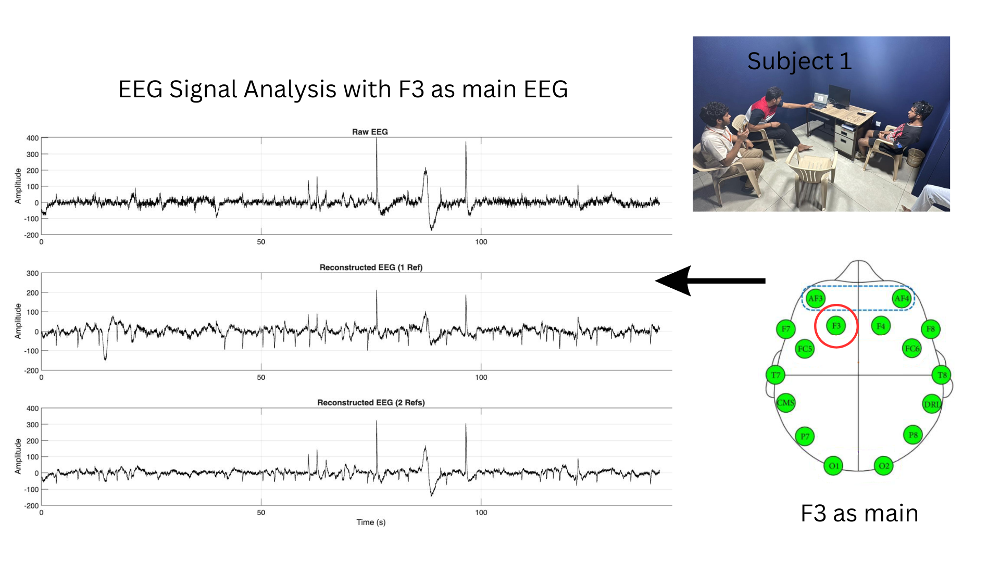
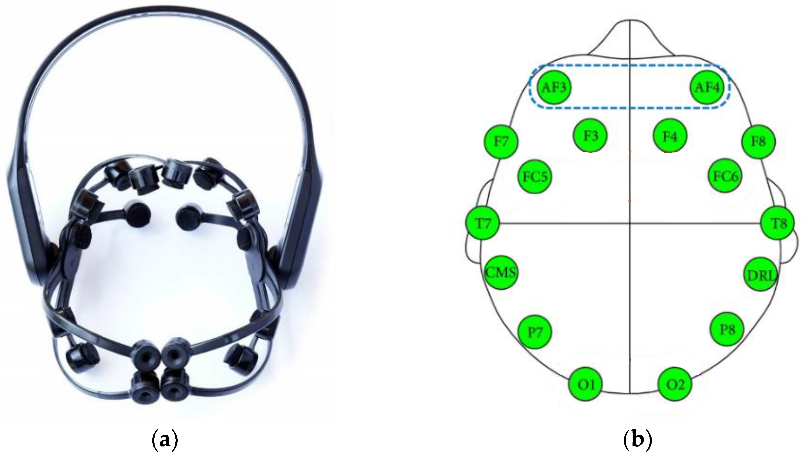
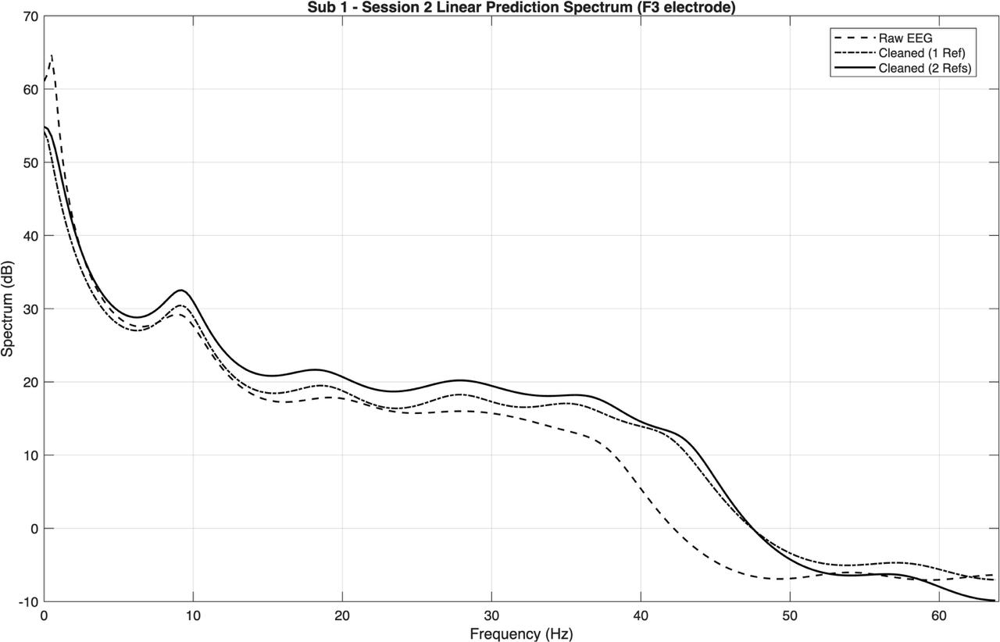
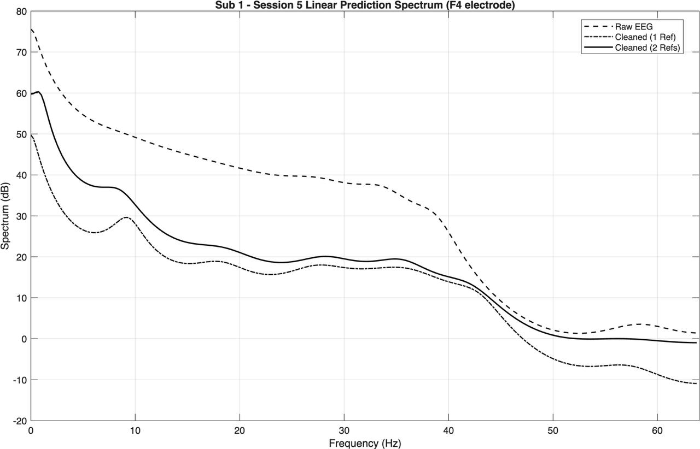

# D9_MFC4_SVD-BASED-NOISE-REDUCTION-IN-EEG-SIGNALS-

SVD-based artifact attenuation workflow for EEG signals contaminated by EOG components.

## Team

- Manohar P - CB.SC.U4AIE24339
- P. Sai Mrudula - CB.SC.U4AIE24340
- B. Sainath Reddy - CB.SC.U4AIE24309
- K. Pushpak Siva Sai - CB.SC.U4AIE24328

## Reference Paper

- Title: SVD based technique for noise reduction in electroencephalographic signals
- Authors: P.K. Sadasivan, D. Narayana Dutt
- DOI: https://doi.org/10.1016/S0165-1684(96)00129-6

## Project Report

Primary report used for this repository:

- [report.pdf](report.pdf)

The report includes the full derivation, dataset setup, methodology, and detailed discussion across abstract, introduction, SVD separation method, and results sections.

## Method Summary

1. Construct multi-channel matrices using contaminated EEG plus EOG reference channels.
2. Apply SVD decomposition:
   $M = U\Sigma V^T$
3. Identify artifact-dominant components using singular value structure.
4. Reconstruct artifact-reduced EEG using the selected subspace projection.
5. Validate in time domain and LP spectral domain.

## Results Folder

All visual outputs were added under:

- [results](results)

This folder contains experiment visualizations, including:

- time-domain signal figures
- LP spectral comparisons
- session-wise plots and supporting visuals

## Visual Samples

## Key Observations (From Report)

- SVD projection effectively attenuates dominant ocular artifacts.
- Structural EEG morphology is preserved after reconstruction.
- Spectral characteristics remain consistent with expected EEG rhythm behavior.
- The report documents stronger reconstruction quality when using robust reference-channel configuration.

## Repository Structure

- [report.pdf](report.pdf): final project report
- [results](results): result figures copied from the project output folder
- [thisone](thisone): supporting project files/dataset bundle
- [code_new.mlx](code_new.mlx): MATLAB implementation notebook
- [mfc_proj_123.mlx](mfc_proj_123.mlx): supplementary MATLAB workflow
